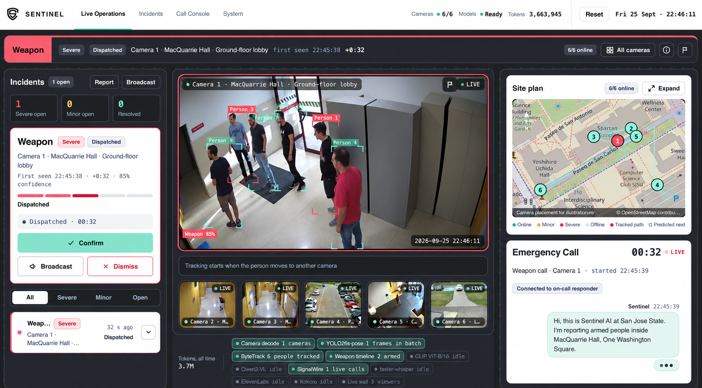
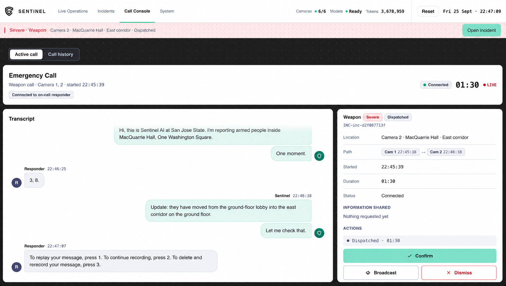
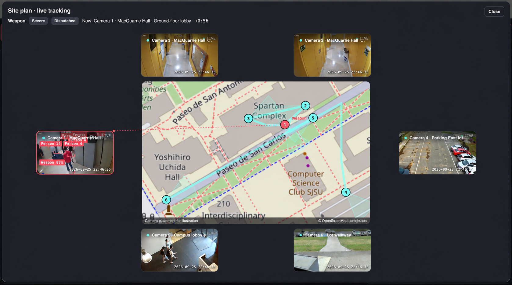
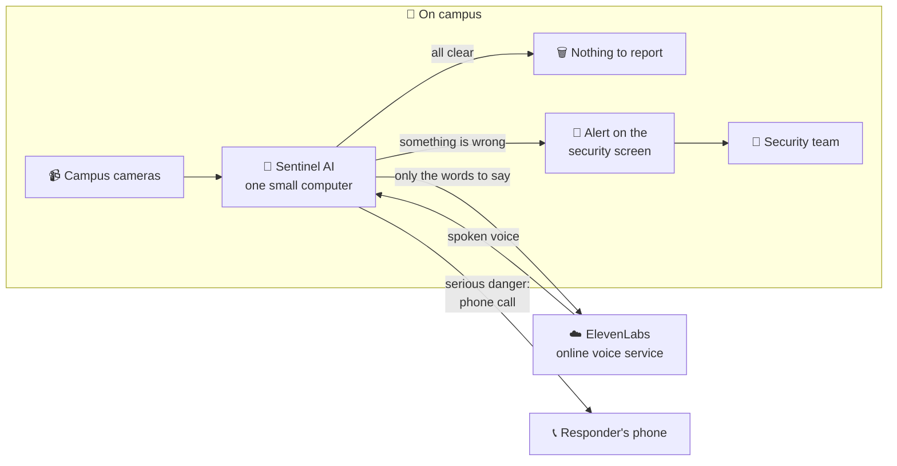
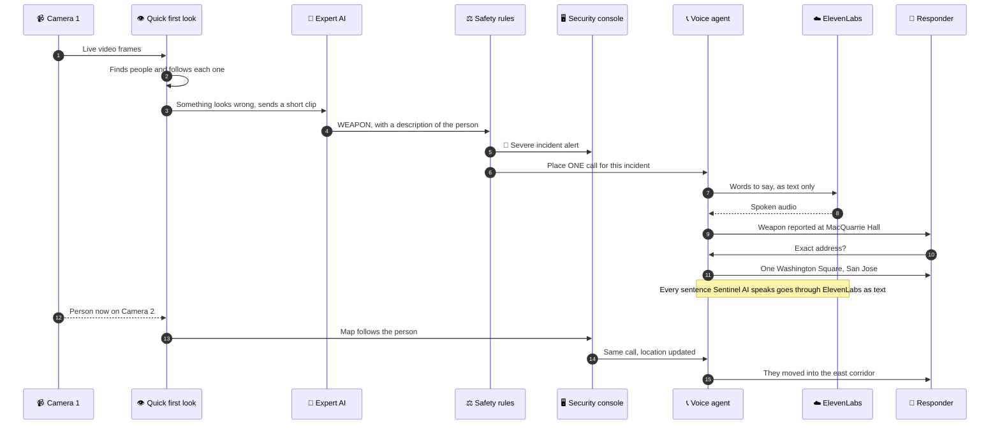
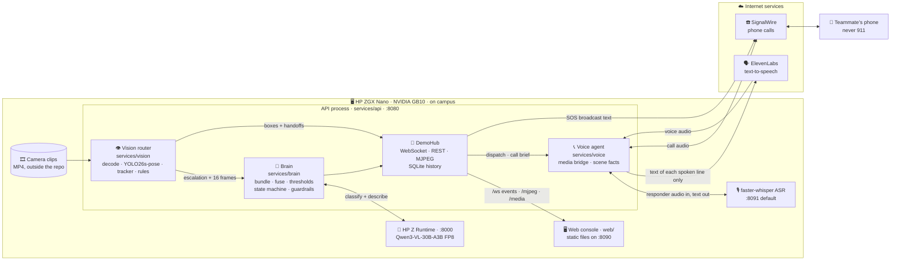

<p align="center">
  <picture>
    <source media="(prefers-color-scheme: dark)" srcset="web/assets/logo-inverse.png">
    
  </picture>
</p>

<h1 align="center">Sentinel AI</h1>

<p align="center">
  <b>Local AI that spots danger early, follows it across cameras, and gives responders the facts.</b>
</p>

<p align="center">
  
  
  <br>
  
  
  
  
  
  
  
</p>

<p align="center">
  <a href="#-watch-the-demo">Demo</a> ·
  <a href="#-the-problem">Problem</a> ·
  <a href="#-what-sentinel-ai-does">What it does</a> ·
  <a href="#-privacy-first">Privacy</a> ·
  <a href="#-a-day-with-sentinel-ai">Story</a> ·
  <a href="#-results">Results</a> ·
  <a href="#-the-team">Team</a> ·
  <a href="#%EF%B8%8F-for-developers">For developers</a>
</p>

---

## 🎬 Watch the demo

<p align="center">
  <a href="https://www.youtube.com/watch?v=MFF1DICU6Ow">
    
  </a>
  <br>
  <a href="https://www.youtube.com/watch?v=MFF1DICU6Ow"><b>▶️ Watch the full demo on YouTube</b></a>
</p>

### What it looks like

<p align="center">
  
  <br><sub><b>Live Operations.</b> Six cameras, a weapon alert on Camera 1, the campus map, and the emergency call starting on the right.</sub>
</p>

<table>
  <tr>
    <td width="50%"></td>
    <td width="50%"></td>
  </tr>
  <tr>
    <td><sub><b>Call Console.</b> Every word of the call, live, next to the incident details.</sub></td>
    <td><sub><b>Live tracking.</b> The map shows which camera sees the person right now.</sub></td>
  </tr>
</table>

---

## 🤔 The problem

**Cameras record everything. Humans can't watch everything.**

Think about a campus at night. A fight breaks out behind the library. Someone walks into a building with a weapon. A student collapses in an empty stairwell. Almost every one of those moments is on camera. Yet almost every time, **nobody sees it until it's too late**. The footage becomes evidence *after* the fact, not help *during* it.

The problem isn't a lack of cameras. It's a lack of eyes.

<table>
  <tr>
    <td align="center" width="33%"><h2>23,400</h2>on-campus crimes reported at U.S. colleges in 2021</td>
    <td align="center" width="33%"><h2>2.1</h2>sworn officers for every 1,000 students</td>
    <td align="center" width="33%"><h2>93%</h2>of public schools already use security cameras</td>
  </tr>
</table>

<sub>Sources: NCES, <i>Criminal Incidents at Postsecondary Institutions</i> (2021) · BJS, <i>Campus Law Enforcement Agencies Serving 4-year Institutions, 2021–22</i> · NCES, <i>School Survey on Crime and Safety, 2021–22</i>.</sub>

A handful of officers can't watch hundreds of screens around the clock. So most cameras are just recording, and nobody is looking.

---

## 💡 What Sentinel AI does

Sentinel AI is like **a security guard who never blinks and can watch every camera at once**.

It watches every camera feed live. When something looks wrong, a powerful AI takes a closer look and decides what it is, for example a weapon, a fight, a theft, someone running, or a medical emergency. If it's serious, Sentinel AI raises an alert on the security team's screen, **follows the person from camera to camera** on a live campus map, and can **phone for help by itself**. On that call it answers the responder's questions using only facts it can see.

The watching and the thinking happen on **one small computer on campus**, the HP ZGX Nano. This is called *edge AI*: the AI runs right where the cameras are, not on the internet, so camera footage never has to leave the building. The only part that uses the internet is the phone call itself, including the voice Sentinel AI speaks with.



---

## ✨ Key features

| | Feature | What this means for you |
|:---:|---|---|
| 👁️ | **Watches every camera, all the time** | No feed goes unwatched, even at 3 a.m. |
| 🧠 | **Understands what it sees** | It tells a weapon from a fight, a theft, someone running, or a medical emergency, instead of just reacting to movement. |
| 🧭 | **Follows the person across cameras** | When someone moves from the lobby to a hallway, the alert and the map move with them. |
| 🗺️ | **Live campus map** | Security sees exactly which camera, building and hallway at a glance. |
| 📞 | **Calls for help by itself** | For a serious incident, it places one call and answers questions like "Exact address?" and "Where are they now?" in a natural voice. |
| ✅ | **Facts, not guesses** | Addresses and locations come from a fixed campus camera list, never made up by the AI. If it doesn't know, it says so. |
| 🛑 | **Humans stay in control** | Plain rules, not the AI, decide when to call. There is one call per incident, and a kill switch stops all calls. Officers can confirm, dismiss, or send a broadcast from the console. |
| 🔒 | **Camera footage stays on campus** | The video is analyzed on campus and never uploaded. |

---

## 🔒 Privacy first

Most "smart camera" services upload your video to the cloud (someone else's computers on the internet) and analyze it there. **Sentinel AI does the opposite: it moves the computer to the video, not the video to the computer.**

**What stays on campus, on the HP ZGX Nano:**
- 📹 Every camera frame, and every image the AI looks at
- 🧠 All of the AI's reasoning and every decision about what is dangerous and whether to call
- 👂 Understanding what the responder says on the phone (speech recognition)
- 🗂️ The incident history

**What goes over the internet, and only when there is an incident:**
- 🗣️ **To ElevenLabs** (an online voice service): the **text** of each sentence Sentinel AI says on the call, for example *"They have moved into the east corridor."* ElevenLabs sends back the spoken audio. **No video and no images are ever sent.**
- 📞 **To SignalWire** (the phone company service that places the call): the **phone call audio in both directions**, meaning Sentinel AI's voice and the responder's voice. If an officer sends an **SOS broadcast** from the console, its message text goes to SignalWire too, so it can be texted or read out on a call.

**What Sentinel AI never does:** it does no face recognition, keeps no identity database, and does no matching against student lists. It only describes what a person looks like, for example "adult in dark clothing".

**Why this matters:**

| | |
|---|---|
| 🔐 **Privacy** | Video of students and staff never leaves campus. Only short sentences meant to be spoken on a call go out. |
| ⚡ **Speed** | Spotting danger needs no round trip to a faraway data center. |
| 📉 **Less bandwidth** | The system sends a few sentences, not hours of video. |
| 💵 **Predictable cost** | The video analysis runs on your own hardware, not a bill for every request. The call voice is the only part billed by use: ElevenLabs charges by the number of characters spoken. |

---

## 📖 A day with Sentinel AI

> *Our demo uses a staged "mock attack" recording played through three cameras, placed at MacQuarrie Hall at San José State University. The call goes to a teammate's phone, **never to 911**.*

**10:45 p.m.** Six cameras show a quiet campus. People walk through the lobby. Nothing is happening, and Sentinel AI keeps watching.

**10:45:38.** A person carrying a weapon enters the **ground-floor lobby (Camera 1)**. The quick first-pass AI notices, and a short clip goes to the expert AI. The expert confirms: **Weapon, Severe.** A red alert appears on the security console.

**10:45:39.** Plain rules check the situation. It is a verified weapon, and no call has been placed for this incident yet. So Sentinel AI **places one call**:

> 🤖 *"Hi, this is Sentinel AI at San Jose State. I'm reporting armed people inside MacQuarrie Hall, One Washington Square."*
>
> 👮 *"Exact address?"*
>
> 🤖 *"One Washington Square, San Jose."*

**10:46:38.** The person moves into the **east corridor (Camera 2)**. Sentinel AI follows. The map updates, and the **same call** gets an update: *"They have moved from the ground-floor lobby into the east corridor on the ground floor."*

**Next, Camera 3.** They reach the **west corridor near the stairwell**. It is the same incident and the same call, updated live.

**One detection. One call. Three handoffs. No human had to notice first.**



---

## 📊 Results

These are real measurements taken on the HP ZGX Nano during the hackathon (sample data in [`bench/`](./bench/)).

| What we measured | Result |
|---|---|
| 🎥 Live camera wall with detection boxes (15 fps clip pack) | **13–14 frames per second** (up from about 3) |
| 🗣️ ElevenLabs voice: time until the first sound is ready (short line, warm connection) | **157–160 milliseconds** |
| 👂 Voice reply, from the moment the caller stops talking to the answer audio being ready (local phone-audio test) | **0.75–1.20 seconds** <!-- TODO: confirm whether this was measured before ElevenLabs was switched on --> |
| 🧠 Expert AI model size | **30 billion parameters**, but only about **3 billion** are used at each step. That keeps it fast on one small box. |
| 🎯 Weapon labels lined up with the demo video | **640 of 649** frames matched |
| 📹 Cameras on the demo wall | **6** (3 running full AI analysis, 3 background feeds) |

> **Honest note:** We have not measured detection accuracy yet. The alert thresholds are demo settings, not tuned on labelled data (see [`bench/thresholds.json`](./bench/thresholds.json) and [`docs/OPEN_ML_ITEMS.md`](./docs/OPEN_ML_ITEMS.md)).

---

## 👥 The team

Built for **Edge AI SJSUHack 2026** by **Ayush · Pratham · Manav · Naman · Indraneel**.

---

## 🛠️ For developers

> Everything below is technical. If you're not a developer, you've seen the whole story. Thanks for reading! 👋

### Tech stack

Everything here comes from the code. The repo has no `requirements.txt`, `pyproject.toml` or `package.json`, so Python packages are **not version-pinned**; versions are listed only where the code or config fixes them.

#### 🎥 Video & vision

| Tech | Version / model | What it does in Sentinel AI |
|---|---|---|
|  | `yolo26s-pose.pt` | Finds every person in each frame and their body pose (17 points per person). |
|  | not pinned | Runs the YOLO and CLIP models on the GPU (or CPU). |
|  | `ViT-B-16`, `openai` weights | Scores cropped people for suspicious activity (VadCLIP-style). It is skipped while the weapon timeline is loaded. |
|  | not pinned | Reads the camera video files frame by frame. |
|  | installed in the API image | Encodes frames for the live camera wall and prepares the demo clips. |
|   | not pinned | Image and array handling for the models. |
|  | `bluenviron/mediamtx:latest` | Optional relay for real RTSP cameras. **Not used in the demo.** |

#### 🧠 AI brain

| Tech | Version / model | What it does in Sentinel AI |
|---|---|---|
|  | host `zrt` on `:8000` | Serves the large AI model locally through an OpenAI-compatible API. |
|  | `Qwen/Qwen3-VL-30B-A3B-Instruct-FP8` | Looks at a 16-frame clip, names the incident type, and describes the person. |
|  | `hf:` model id | Where HP Z Runtime downloads the Qwen weights (once, at setup). |
| Plain Python | — | Fusion, severity thresholds, incident state machine and guardrails. The rules decide, not the model. |

#### 🗣️ Voice & calling

| Tech | Version / model | What it does in Sentinel AI |
|---|---|---|
|  | `eleven_flash_v2_5`, voice "Sarah", `ulaw_8000` | Turns each sentence Sentinel AI says into speech, streamed straight onto the phone line. It is called over HTTPS with Python's standard library, with no SDK. |
|  | Compatibility (LaML) API | Places the phone call, streams call audio both ways, and sends SOS broadcasts. |
|  | `base.en`, int8, CPU | Understands what the responder says, locally on the box. |

#### ⚙️ Backend & APIs

| Tech | Version | What it does in Sentinel AI |
|---|---|---|
|  | 3.12 (API image `python:3.12-slim`) | All backend code. |
|  | standard library | A small hand-written HTTP and WebSocket server, with no web framework. It serves live events, operator actions, video and phone webhooks. |
|  | standard library | Keeps the history of runs, incidents, calls and transcripts. |
| JSON contracts | `contracts/` | Shared, frozen message shapes for incidents, events and the call brief. |

#### 🖥️ Dashboard / web

| Tech | Version | What it does in Sentinel AI |
|---|---|---|
|  | no framework, no npm | The whole security console, as plain JavaScript modules. |
|   | — | Layout and styling, with design tokens and a light/dark theme. |
| SVG + Canvas | built into the browser | Detection boxes, the map overlay, and usage charts, with no chart library. |
|  | static export (`web/assets/site-map.png`) | The campus map. It is a saved image, so no map tiles are loaded from the internet. |

#### 🐳 Infrastructure

| Tech | Version | What it does in Sentinel AI |
|---|---|---|
|   | `docker-compose.yml` | Packages the API service (plus optional MediaMTX). |
|  | `Makefile` | Shortcuts for running and checking the system. |
|  | — | Reads real GPU load for the dashboard's health strip. |
|  | `scripts/preflight_gb10.sh` | Checks GPU memory before starting the big models. |

#### 💻 Hardware

| Tech | What it does in Sentinel AI |
|---|---|
|   | The one on-campus computer that runs the vision, the AI brain, speech recognition and the console. Its CPU and GPU share one memory pool. |

### Architecture

The camera loop, the brain and the voice bridge all run inside **one API process** (`python -m services.api`). HP Z Runtime and speech recognition run as separate local services on the same box. ElevenLabs and SignalWire are the only internet services.



<details>
<summary><b>How a frame becomes a phone call (the four stages)</b></summary>

1. **Screen.** Every frame on cameras 1–3 goes through YOLO26s-pose. A tracker (IoU on a constant-velocity prediction) gives each person a stable ID, and temporal rules (weapon, fall, run, sudden acceleration, long dwell) score what they're doing. Almost everything stops here at near-zero cost.
2. **Escalate.** When the fused score crosses the threshold, the router hands a 16-frame, peak-weighted evidence bundle to the brain.
3. **Judge.** Qwen3-VL (through HP Z Runtime) classifies the clip into one of `WEAPON | FIGHT | THEFT | RUN | MEDICAL | BENIGN` using token logprobs (Completion A), and writes a short person description (Completion B).
4. **Decide.** Plain code, not the model, sets severity (`bench/thresholds.json`: minor ≥ 0.55, severe ≥ 0.80), moves the incident through its states (`NEW → ALERTED → DISPATCH_PENDING → DISPATCHED → TRACKING → RESOLVED`, or `DISMISSED`), and applies guardrails: one dispatch per incident, an hourly cap (`CS_DISPATCH_HOURLY_CAP`, default 6), and a kill switch (`CS_KILL_SWITCH`). The address and location on the call come from `data/camera_map.json`, never from the model.

</details>

<details>
<summary><b>How the call voice works</b></summary>

- Every line Sentinel AI speaks is a `call.transcript_delta` event. The media bridge sends **only that line's text** (plus the model id and voice settings) to `api.elevenlabs.io/v1/text-to-speech/<voice>/stream` over one keep-alive HTTPS connection per call (`services/voice/elevenlabs.py`, Python standard library, no SDK).
- ElevenLabs returns `ulaw_8000` audio, which is SignalWire's phone codec, so the chunks go straight onto the call as they arrive.
- If no first chunk arrives within `CS_ELEVENLABS_FIRST_CHUNK_S` (default 1.5 s), or the request fails, that one line is spoken by a **local backup voice** instead (never both). A bad key or quota error pauses ElevenLabs for 10 minutes.
- Short repeated lines (fillers, "could you repeat that") are cached so they are billed once. The ElevenLabs free tier is 10,000 characters per month.
- `GET /voice/status` shows which voice provider is active. It never shows the key.

</details>

<details>
<summary><b>What is live in the demo, and what is pre-computed</b></summary>

- **Live:** person detection, tracking, camera handoffs, escalation, Qwen incident classification, the dashboard, and the phone call.
- **Pre-computed:** weapon *boxes*. Small handguns in 960×540 footage were not detected reliably live, whether by per-person CLIP, YOLOE open-vocabulary or per-crop Qwen. So `data/feeds/seville_weapon_timeline.json` replays the dataset's hand-drawn weapon boxes by clip time, and the armed person's box turns red.
- **Shared result:** Qwen runs once on Camera 1, and Cameras 2 and 3 reuse that result.
- **Background feeds:** Cameras 4–6 are ambient feeds and never enter YOLO or Qwen.
- **Recording mode:** for the video recording, `CS_CALL_MODE=scripted` plays a pre-written call keyed to the clip time (see `services/voice/demo_call.py`). Real calls answer common questions instantly from `services/voice/scene.py`.

</details>

### Services and ports

| Service | What it does | Port / address | Where it runs |
|---|---|---|---|
| **api** | WebSocket hub, REST actions, MJPEG and MP4 streams, SQLite history. It also hosts the vision loop, the brain and the voice bridge. | `8080` | `make api`, or the Docker Compose `api` service |
| **HP Z Runtime** | Serves Qwen3-VL-30B-A3B FP8 (OpenAI-compatible) | `8000` | On the host (`zrt serve`), never in Compose |
| **web** | Security console (static files) | `8090` | `python3 -m http.server 8090 --directory web` |
| **ASR** | faster-whisper speech-to-text, `POST /transcribe` | `8091` (script default) | `scripts/serve_parakeet.py` (the name is historical) |
| **ElevenLabs** ☁️ | Text-to-speech for every call line | `https://api.elevenlabs.io` | Cloud. Needs `CS_TTS_PROVIDER=elevenlabs` and `ELEVENLABS_API_KEY`. |
| **SignalWire** ☁️ | Outbound call, call audio stream, SOS broadcasts | your SignalWire space | Cloud. Calls back to `/signalwire/*` on the API through `CS_PUBLIC_BASE`. |
| **mediamtx** *(optional)* | RTSP relay for real cameras. Not used by the demo. | `8554` | `docker compose --profile full up mediamtx` |

<details>
<summary><b>API routes</b></summary>

| Route | Purpose |
|---|---|
| `GET /health` | Health check |
| `GET /ws` | WebSocket event stream (`contracts/events.py`) |
| `GET /api/site` | Site and camera map |
| `POST /api/incidents/manual`, `/api/incidents/{id}/dispatch`, `/confirm`, `/dismiss` | Operator actions |
| `POST /api/broadcast` | Security broadcast |
| `GET /voice/status` | Voice readiness (never returns secrets) |
| `POST /signalwire/voice`, `GET /signalwire/media`, `POST /signalwire/sos` | Phone call webhooks and audio stream |
| `GET /mjpeg/{cam}` | Live frames for cameras 1–3 (the exact frames the vision loop saw) |
| `GET /media/{cam}` | Byte-range MP4 for ambient cameras 4–6 |

</details>

### Folder structure

```text
.
├── contracts/          Shared data shapes: incidents, WebSocket events, call brief (frozen)
├── services/
│   ├── api/            HTTP + WebSocket server, DemoHub, video streams, history DB, vision bridge
│   ├── brain/          Qwen client (via Z Runtime), fusion, thresholds, state machine, guardrails, call brief
│   ├── vision/         Video decode, YOLO26s-pose, tracker, motion rules, CLIP scorer, weapon timeline
│   ├── voice/          SignalWire bridge, media bridge, ElevenLabs client, call agent, scene facts
│   ├── mediamtx/       Optional RTSP relay config (not used in the demo)
│   └── activity.py     Model activity + token usage counters shown on the dashboard (with usage.py)
├── web/                Security console: plain HTML/CSS/JS, no build step (see web/README.md)
├── data/               Camera map, demo scenario, feed manifests, scene script, weapon timeline
├── scripts/            Timeline builders, speech servers, GB10 preflight, perf probe, calibration fit
├── bench/              Severity thresholds and the latest performance sample
├── docs/               Stability notes, open ML items, clip notes, design docs, README assets
├── docker-compose.yml  One machine, one compose file
├── Makefile            Shortcuts: api, check, up, demo, reset
└── .env.example        Settings template. Copy to .env on the box and never commit it.
```

### Prerequisites

- **For the full live system:** an HP ZGX Nano (NVIDIA GB10) or a similar Linux + NVIDIA GPU machine, with **HP Z Runtime** (`zrt`) installed
- **Python 3.12**, **ffmpeg**, and **Docker + Docker Compose** (for `make up`)
- YOLO and CLIP weights in `services/vision/weights/` (fetched by `services/vision/pull_weights.py`, never committed)
- The demo camera clips, which live **outside the repo** (see below)
- **An ElevenLabs API key.** This is a private access code from your ElevenLabs account. It lets Sentinel AI use ElevenLabs' online service to speak on the phone.
- **A SignalWire account** (project ID, API token and a phone number) for real phone calls, plus a public HTTPS address that SignalWire can reach (`CS_PUBLIC_BASE`)

### Set up your `.env`

Copy the template and fill it in on the box. **Never commit `.env`.**

```bash
cp .env.example .env
```

```bash
# Voice: ElevenLabs (the code's default is the local backup voice, so set this)
CS_TTS_PROVIDER=elevenlabs
ELEVENLABS_API_KEY=<your-elevenlabs-api-key>
# optional: CS_ELEVENLABS_VOICE_ID, CS_ELEVENLABS_MODEL, CS_ELEVENLABS_TIMEOUT_S

# Phone calls: SignalWire
CS_SIGNALWIRE_ENABLED=1
CS_KILL_SWITCH=0            # set to 1 whenever you test without meaning to call
SIGNALWIRE_SPACE=<your-space>
SIGNALWIRE_PROJECT_ID=<your-project-id>
SIGNALWIRE_API_TOKEN=<your-api-token>
SIGNALWIRE_FROM=<your-signalwire-number>
CS_DEMO_TO_NUMBER=<teammate-phone-never-911>
CS_PUBLIC_BASE=<public-https-url-for-this-box>
```

### Run it

**Just want to see the console?** No GPU and no keys are needed. The console plays a built-in demo timeline when it isn't connected to the backend:

```bash
python3 -m http.server 8090 --bind 127.0.0.1 --directory web
# open http://localhost:8090/
```

**Make targets:**

```bash
make help    # list the targets
make check   # self-checks for brain, api, voice and OSNet
make api     # run the API on 127.0.0.1:8080 (no Docker)
make up      # docker compose up --build api
make demo    # prints the steps to start the API and the console
make reset   # prints how to reset; use the dashboard's Reset button or send {"cmd":"reset"} over the WebSocket
```

> `make demo` and `make reset` only print instructions for now, and `make bench` is not wired yet. The Compose `api` image contains `contracts/`, `services/brain/` and `services/api/` only. The full live stack (vision on the GPU plus Qwen) runs as host processes.

<details>
<summary><b>Full live stack on the ZGX Nano</b></summary>

Read [`docs/STABILITY.md`](./docs/STABILITY.md) first. Running Qwen and CUDA YOLO together can exhaust the GB10's unified memory and hard-lock the box.

```bash
bash scripts/preflight_gb10.sh

# 1. Qwen through HP Z Runtime (keep the GPU fraction at 0.40 so YOLO fits)
zrt serve hf:Qwen/Qwen3-VL-30B-A3B-Instruct-FP8 --force --gpu-memory-fraction 0.40 \
  --extra "--max-model-len=8192"

# 2. API + vision (only after Z Runtime is healthy)
set -a; . ./.env; set +a; export PYTHONPATH=.
CS_VISION_SEVILLE=1 CS_VISION_DEVICE=cuda:0 \
  CS_VISION_CONF=0.50 CS_VISION_COOLDOWN_S=600 CS_VISION_MAX_UPSERTS_MIN=1 \
  services/vision/.venv/bin/python -m services.api --host 0.0.0.0 --port 8080

# 3. Console, in another shell
python3 -m http.server 8090 --bind 0.0.0.0 --directory web
# open http://<box>:8090/?ws=ws://<box>:8080/ws   (add &nosplash=1 to skip the intro)
```

More settings (`CS_CALL_MODE`, `CS_MEDIA_ROOT`, `CS_DB_PATH`, and others) are documented in [`.env.example`](./.env.example).

</details>

### Video feeds and model weights live outside the repo

Video files and model weights are **never committed**. The demo clips live next to the repo on the ZGX:

| What | Path (ZGX) |
|------|------------|
| **Locked 3-camera demo (stream from here)** | `/home/hp25/Documents/campus_sentinel_media/feeds/seville_option1_3cam_locked/` |
| Ambient clips for cameras 4–6 | `/home/hp25/Documents/campus_sentinel_media/feeds/naman/demo_clips/` (see [`docs/NAMAN_CLIPS.md`](./docs/NAMAN_CLIPS.md)) |
| Path map + FileSource example (in repo) | [`data/feeds/seville_option1_3cam_locked.json`](./data/feeds/seville_option1_3cam_locked.json) |
| Camera IDs and locations (in repo) | [`data/camera_map.json`](./data/camera_map.json) |
| Research originals (tmp, do not stream) | `/home/hp25/tmp/campus_sentinel_clip_research/` |

- **Mac mount:** `~/mnt/zgx-b505/Documents/campus_sentinel_media/...` (SSHFS mount of the ZGX home folder via the team's `zgx-up` helper)
- **Override:** `CS_MEDIA_ROOT` points the API at a different clip folder
- **Model weights:** stay in `services/vision/weights/` (gitignored). Qwen is pulled and cached by HP Z Runtime.

Preview the clips on their own (from the media root):

```bash
cd /home/hp25/Documents/campus_sentinel_media/feeds/seville_option1_3cam_locked
python3 -m http.server 8765 --bind 127.0.0.1
# → http://127.0.0.1:8765/dashboard.html
```

---

## 🤝 Contributing

1. **Read first:** the [For developers](#%EF%B8%8F-for-developers) section above and [`docs/STABILITY.md`](./docs/STABILITY.md) before running anything on the GB10.
2. **Contracts are shared:** changes to `contracts/` need the whole team's agreement.
3. **Branch:** `feat/<name>/<thing>`, and merge the same day.
4. **Sync:** run `git pull --rebase origin main` before every push.
5. **Never commit** model weights, video clips, API keys, or `.env`. Mock CCTV MP4s belong only under `Documents/campus_sentinel_media/`, next to this repo and never inside it.

---

## 🙏 Acknowledgments

<p align="center">
  
  <br><sub>Built at San José State University with HP hardware and software.</sub>
</p>

- **Edge AI SJSUHack 2026** and San José State University, for the challenge and the campus that inspired it
- **HP**, for the **ZGX Nano AI Station** and **HP Z Runtime**, which made local AI possible
- **NVIDIA**, for the GB10 chip inside the ZGX Nano
- **Qwen team**, for Qwen3-VL
- **Ultralytics** (YOLO), **OpenCLIP** and **faster-whisper**, the open-source models that power the pipeline
- **ElevenLabs**, for the call voice, and **SignalWire**, for phone calling
- **OpenStreetMap contributors**, for the campus map
- The authors of the **mock attack CCTV dataset** used for our demo footage <!-- TODO: confirm dataset name, authors and license (University of Seville "US Mock Attack" dataset?) -->

<p align="center"><sub>Sentinel AI · local AI that watches, reasons and responds · Powered by HP ZGX Nano</sub></p>
